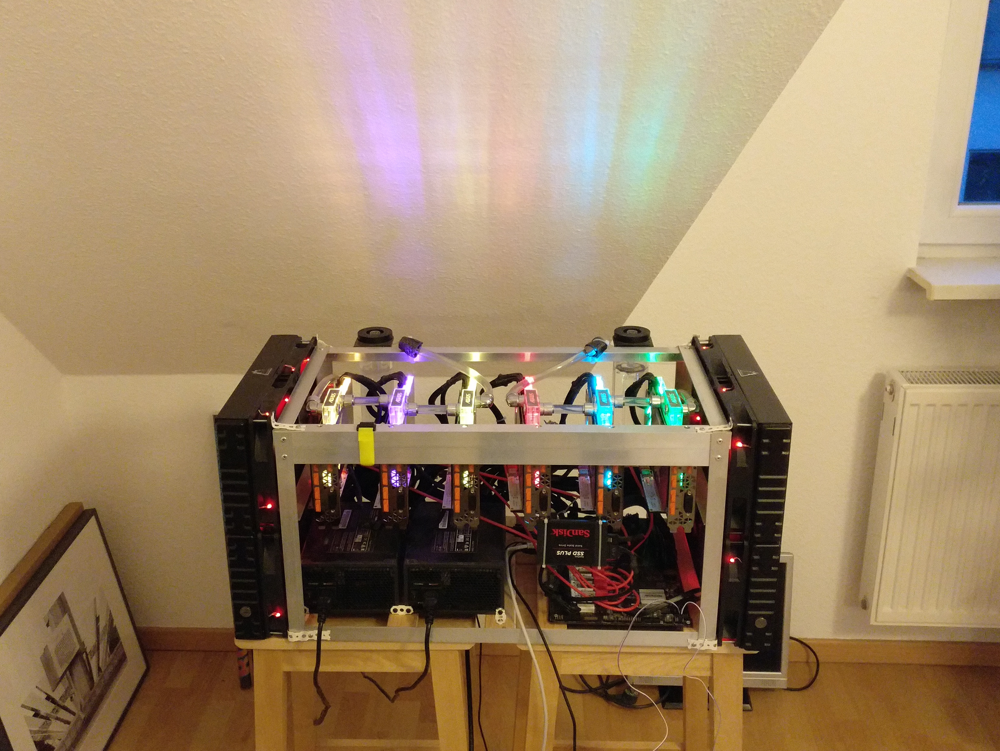

# Covid19@Home

What's this all about? See [Folding@Home AMA](https://www.reddit.com/r/pcmasterrace/comments/flgm7q/ama_with_the_team_behind_foldinghome_coronavirus/.compact)

Adapted from https://github.com/stefancrain/folding-at-home for my 6x GTX 1080 TI GPU rig



Inside the container first check `nvidia-smi` to make sure GPUs are visible.

```
docker run --runtime=nvidia --ipc=host -it --rm --entrypoint bash danieljh/covid19-at-home
```

And away we go!

```
docker run --runtime=nvidia --ipc=host --network=host -it --rm danieljh/covid19-at-home --team=245416 --power=full --gpu-usage=100 --cpu-usage=100
```


I manually built and pushed the image once (see [tags on docker hub](https://hub.docker.com/r/danieljh/covid19-at-home/tags))

```
docker build -t danieljh/covid19-at-home -f ./build/Dockerfile ./build
docker push danieljh/covid19-at-home
```
